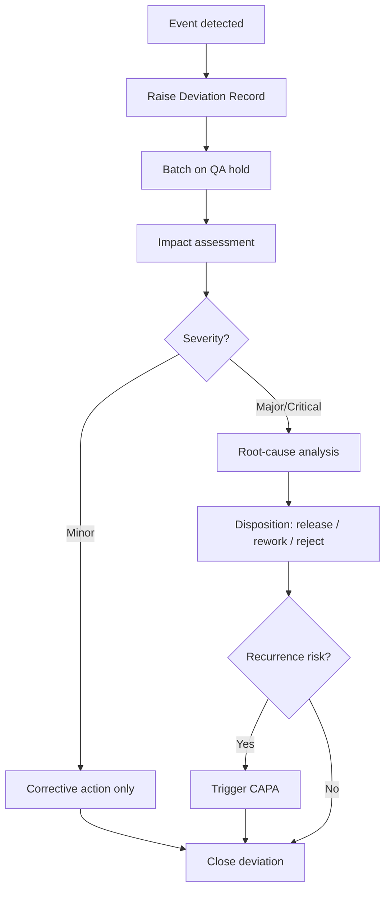
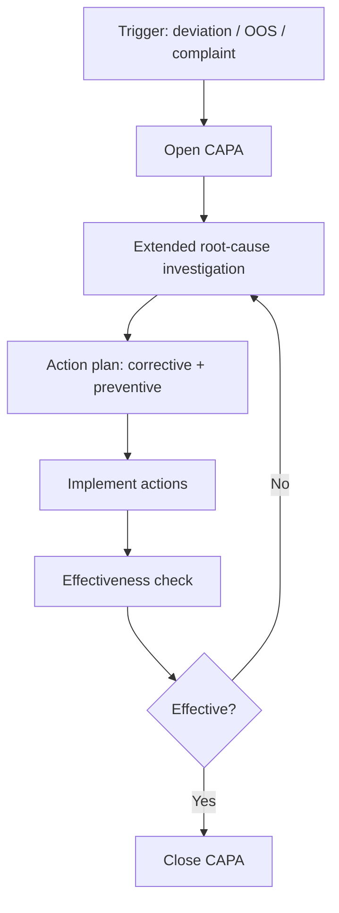
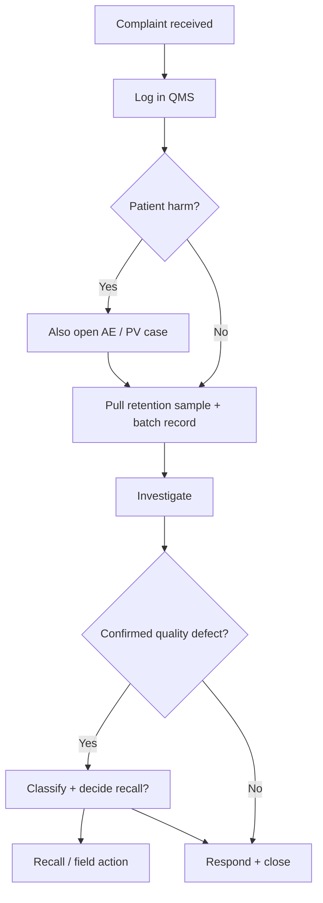
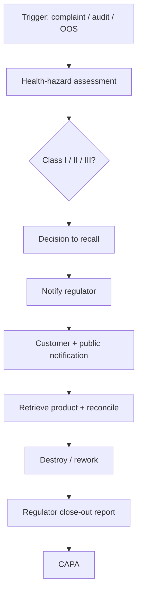
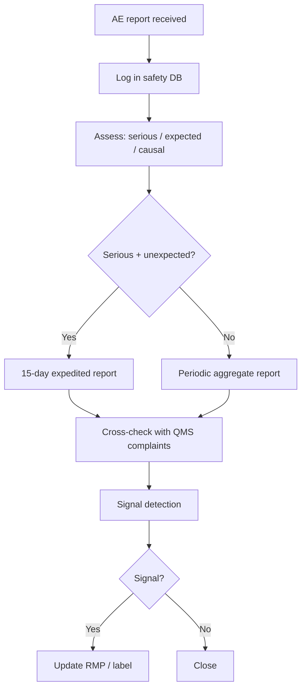
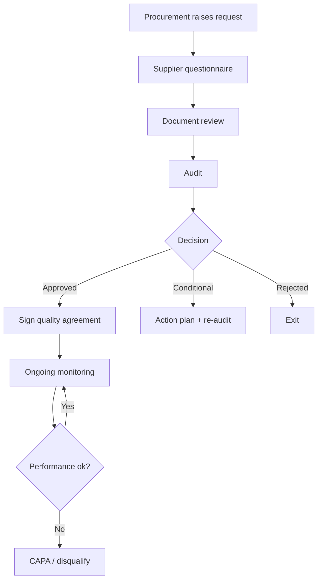
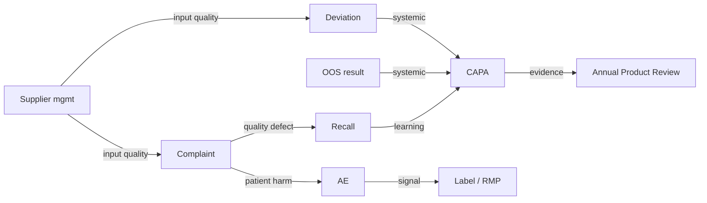

# Task 2 — QMS Study Guide (Supply Chain OS · Life Sciences)

> **Use this as a study / talking-points document for your 10–25 minute video recording.**
> The assignment explicitly forbids AI-generated visuals — use these mermaid diagrams
> only as a reference. For your final submission, redraw the flowcharts **by hand**
> (paper or whiteboard) or build the PPT manually, and keep the video with your
> face visible and audio clear.

---

## 0. Framing — what is a QMS and where it sits

A **Quality Management System (QMS)** is the process + documentation + evidence layer that
keeps a life-sciences manufacturer compliant with regulators (FDA 21 CFR Part 210/211,
EU GMP Volume 4, ICH Q7 for APIs, ICH Q10 for the PQS, WHO TRS 986, Schedule M).

In a **Supply Chain OS** platform it stitches together three domains:

| Domain | What it tracks | Typical triggers |
|---|---|---|
| **In-Process Quality** | Events during manufacturing | batch deviation, OOS result |
| **In-Product Quality** | Events after product is released | complaint, ADR report, recall notice |
| **QMS Management** | Ecosystem governance | supplier onboarding, audit cycle |

**APIs (Active Pharmaceutical Ingredients)** = the therapeutically active molecules (e.g.
Atorvastatin Calcium, Metformin HCl). Made to **ICH Q7**.

**FDF (Finished Dosage Forms)** = the final tablet/capsule/injection sold to the patient
(e.g. Atorvastatin 10mg tablet). Made to **21 CFR 211 / EU GMP Part I**.

**Raw Materials** = excipients (lactose, MCC, starch), solvents (methanol, toluene),
reagents, packaging components — everything that enters the plant but isn't the API itself.

---

## 1. Deviation Management  *(In-Process Quality)*

### Purpose
Capture any departure from approved procedures, specifications, or parameters so that the
impact is assessed, product disposition is decided, and repeat occurrences are prevented.

### End-to-end flow
1. **Detect** — operator / analyst notices deviation (e.g. mixer RPM drifted out of spec).
2. **Log** — raise a Deviation Record (DR#) in the QMS with batch, equipment, time, severity.
3. **Contain** — put batch on QA hold; quarantine material if needed.
4. **Impact assessment** — QA + Production + QC evaluate effect on critical quality attributes.
5. **Root-cause analysis** — 5-Why, Fishbone, or equivalent.
6. **Classification** — Minor / Major / Critical.
7. **Disposition** — Release, Rework, Reprocess, Reject, or escalate to CAPA.
8. **Close-out** — QA approval, training, document revision.

### Flowchart (reference — redraw by hand)

### Example — **API (Atorvastatin Calcium)**
Mid-batch, jacket temperature of the crystallisation reactor spiked 4 °C above the validated
upper limit for 7 minutes. Deviation DR-API-0127 is logged. QA holds the batch; QC runs
polymorph characterisation — desired Form I crystal pattern is still intact. Batch is
released with an annotation, and the reactor's PID loop is re-tuned (Minor, no CAPA).

### Example — **Raw Material (Lactose Monohydrate)**
Incoming lactose drum arrives with a torn liner. DR-RM-0044 is logged. Sample pulled for
moisture test — result 1.2 % above spec. Drum quarantined; vendor notified. Classification:
Major. CAPA triggered (see §2).

### Role perspectives
| Role | What they do here |
|---|---|
| **Quality Executive / QA Officer** | Owns DR workflow, performs classification, approves disposition, runs trending (monthly KPI: deviations per 100 batches). |
| **Production Manager** | Detects deviation on the shopfloor, supplies batch context and equipment logs, implements corrective action on the line, signs off the operator-training refresh. |

---

## 2. CAPA — Corrective and Preventive Actions  *(In-Process Quality)*

### Purpose
Convert a proven root cause into a **systemic** fix so the same (or related) problem
doesn't resurface.

- **Corrective Action** = fixes *what already went wrong*.
- **Preventive Action** = stops it from happening elsewhere / in future.

### End-to-end flow
1. **Trigger** — usually a Deviation, an OOS, a complaint, an audit finding, or trend data.
2. **Open CAPA record** with owner, due date, linked trigger.
3. **Investigate** — extend the deviation's RCA to system level.
4. **Action plan** — list corrective + preventive tasks, owners, deadlines.
5. **Implement** — SOP revisions, training, equipment change, spec update.
6. **Effectiveness check** — after 30/60/90 days verify the fix worked (no recurrence,
   improved metric).
7. **Close** with QA approval; loop learnings back to PQS (ICH Q10).

### Flowchart

### Example — **API**
Three deviations in six months on the Atorvastatin crystalliser (temperature overshoots).
CAPA-089 opened. Corrective: re-tune PID loops on R-201/R-202. Preventive: add automated
high-temperature interlock across all crystallisers; update SOP-API-014; requalify four
operators. Effectiveness check at 90 days → zero recurrences → close.

### Example — **Raw Material**
Supplier-side issue with torn lactose drum liners repeats twice. CAPA-102 opened.
Corrective: reject current lot; re-source. Preventive: add incoming-goods photographic
inspection; require tamper-evident over-wrap in vendor SLA; place vendor on audit watch.

### Role perspectives
| Role | What they do here |
|---|---|
| **QA Officer** | CAPA owner-of-owners; runs monthly CAPA review board, tracks effectiveness, escalates overdue items. |
| **Production Manager** | Often CAPA *action* owner for shopfloor items (equipment, training, line changeover changes); provides evidence of implementation; keeps the CAPA from slipping. |

---

## 3. Product Complaints  *(In-Product Quality)*

### Purpose
Capture, classify, investigate, and respond to any customer / patient / HCP feedback that
suggests a product did not perform as expected, with the goal of protecting patient
safety and identifying systemic quality signals.

### End-to-end flow
1. **Receive** — via pharmacy, hospital, call-centre, field rep, or online.
2. **Log** complaint in QMS with patient-safety flag (Y/N).
3. **Acknowledge** within regulatory SLA (e.g. 3 business days).
4. **Triage** — is this an **Adverse Event** (§5) too? If yes, fork to PV workflow.
5. **Pull batch record + reserve sample** for retest.
6. **Investigate** — product examination, batch review, manufacturing deviation check.
7. **Classify** — Critical / Major / Minor; decide if recall (§4) is warranted.
8. **Respond** to complainant; submit regulatory report if applicable (PQR/FAR).
9. **Trend + close** — aggregate metrics into PQR, APR, and management review.

### Flowchart

### Example — **API**
A formulator downstream reports impurity peak above spec in Atorvastatin API lot
API-24-112. Complaint CMP-0211 opened. Retain tested — peak confirmed. Investigation traces
to an HPLC column batch with cross-contamination; lot partially recalled from two buyers.

### Example — **Raw Material**
Converter reports that drums of lactose from lot RM-24-056 have inconsistent particle size.
Complaint CMP-0212 opened; retain confirms drift from the mesh spec. No recall needed
(material wasn't used in finished product), but the vendor CAPA is linked.

### Role perspectives
| Role | What they do here |
|---|---|
| **QA Officer** | Classification, regulatory reporting decisions, complaint-trend analysis, interface with PV. |
| **Production Manager** | Provides batch records, equipment maintenance history, operator logs; implements any process adjustments resulting from investigation. |

---

## 4. Recall Management  *(In-Product Quality)*

### Purpose
Remove product from the market when a defect poses a health risk or violates regulations,
while preserving traceability, informing the regulator, and protecting brand trust.

### Recall classes (FDA definition — universally used)
- **Class I** — reasonable probability of serious health consequence or death.
- **Class II** — temporary / medically reversible harm.
- **Class III** — unlikely to cause harm but violates regulations.

### End-to-end flow
1. **Trigger** — complaint, audit, regulator notice, own-internal finding.
2. **Health-hazard assessment** — medical affairs + QA classify risk level.
3. **Decision to recall** — QA Head + Business Head; notify regulator (e.g. FDA/CDSCO)
   within 24-72 h depending on class.
4. **Scope** — batches affected, distribution depth (wholesaler / retail / consumer).
5. **Communication** — customer letters, public notice, field-rep outreach.
6. **Retrieval + reconciliation** — accountable units returned; destruction / rework
   decision logged.
7. **Regulator close-out** — submit final report with effectiveness check.
8. **Post-recall CAPA** (§2).

### Flowchart

### Example — **API**
OOS for related-substance in Atorvastatin lot API-24-112 confirmed post-release; three
downstream FDF lots already shipped. Class II recall; 24h regulator notification; all
affected FDF manufacturers notified; retrieved units reprocessed where feasible.

### Example — **Raw Material**
A lactose lot found to have Salmonella contamination is recalled from *FDF manufacturers*
(B2B recall, not consumer). Though not a consumer-facing recall, it must still be logged,
reported to the vendor's competent authority, and tied to a CAPA.

### Role perspectives
| Role | What they do here |
|---|---|
| **QA Officer** | Leads the Recall Committee, classifies, owns regulator communication, runs effectiveness check. |
| **Production Manager** | Supplies batch genealogy (which raw lot → which API lot → which FDF lot), halts further processing, supports reconciliation from warehouse. |

---

## 5. Adverse Event (AE) Reporting  *(In-Product Quality)*

### Purpose
Capture, evaluate, and report any unfavourable medical occurrence associated with a
product — this is a **pharmacovigilance (PV)** obligation distinct from product quality,
even though the two often intersect.

Regulatory anchors: ICH E2B(R3), EU GVP, 21 CFR 314.80, India's PvPI.

### End-to-end flow
1. **Receive** AE (spontaneous, literature, clinical study, social media).
2. **Log** in safety database (ARGUS, Veeva Vault Safety, etc.).
3. **Assess** — serious? expected? causally linked?
4. **Report to regulator** — 15 days for Serious Unexpected, 90 days for non-serious
   (timelines vary by jurisdiction).
5. **Cross-check with QMS** — did a manufacturing deviation or complaint on the same batch
   occur? If yes, link.
6. **Signal detection** — aggregate AEs into PSUR/PBRER.
7. **Risk-management-plan (RMP) update** if signal confirmed.

### Flowchart

### Example — **API / FDF**
Hospital reports three patients on Atorvastatin 10mg experiencing unusually high
rhabdomyolysis markers. All three received FDF from lot 24-551. PV logs SAE-2031; QMS
cross-check finds no manufacturing deviation, but the API lot (API-24-112) is the same one
with the related-substance OOS (§4). Root cause converges — combined recall + safety
signal.

### Example — **Raw Material**
Raw materials don't have direct AE reports (they aren't taken by patients), but a raw-
material contamination that caused an AE in the finished product is linked back via the
batch genealogy during investigation.

### Role perspectives
| Role | What they do here |
|---|---|
| **QA Officer** | Runs the QMS↔PV interface; joins joint investigations when an AE correlates with a complaint or deviation. |
| **Production Manager** | Provides environmental monitoring / deviation / personnel records for the implicated batch; implements any process change from the combined investigation. |

*(In larger orgs, PV is owned by a **Safety / Pharmacovigilance Officer**, not QA — call
that out in your video to show you know the distinction.)*

---

## 6. Supplier Management  *(QMS Management)*

### Purpose
Ensure every external supplier of GMP-critical materials/services is qualified, monitored,
and audited so raw-material risk is pushed upstream.

### End-to-end flow
1. **Identify need** — procurement raises a new-material or new-supplier request.
2. **Supplier questionnaire** — quality system, regulatory approvals, site list.
3. **Document review** — DMF/COAs, GMP certificates, audit reports.
4. **On-site or remote audit** — against ICH Q7 / Q10 or EU GMP Annex 18.
5. **Qualification decision** — Approved / Conditional / Rejected.
6. **Quality Agreement** signed, specs frozen.
7. **Ongoing monitoring** — incoming-QC trends, complaints (§3), deviations (§1),
   periodic re-qualification (typically every 2-3 years).
8. **Disqualification / exit** if performance degrades.

### Flowchart

### Example — **API intermediate supplier**
Sourcing a new supplier for Atorvastatin calcium intermediate. Full on-site audit under
ICH Q7. Supplier qualified with two observations; Quality Agreement caps impurity profile
and requires 12-month stability data every re-qualification.

### Example — **Raw Material (Lactose Monohydrate)**
Excipient supplier qualification against EU GMP Annex 18 + Ph. Eur. monograph. Incoming
QC trends tracked per lot; a sustained particle-size drift triggers a supplier CAPA (see
§2 Raw Material example) and, if unresolved, disqualification.

### Role perspectives
| Role | What they do here |
|---|---|
| **QA Officer** | Owns supplier qualification workflow, maintains Approved Supplier List (ASL), leads audits, signs Quality Agreements, decides re-qualification cadence. |
| **Production Manager** | Reports real-world usability issues (handling, dispensability, yield impact), participates in supplier visits with a user-operations perspective. |

---

## 7. How the six modules interconnect

---

## 8. Regulatory cheat-sheet (drop these into your video narration)

| Reference | What it governs |
|---|---|
| **ICH Q7** | GMP for APIs |
| **ICH Q9** | Quality risk management (classification, FMEA) |
| **ICH Q10** | PQS — the umbrella QMS model |
| **21 CFR 210/211** | US GMP for FDFs |
| **21 CFR 314.80 / MedWatch / ICH E2B(R3)** | AE reporting |
| **EU GMP Annex 15** | Qualification & validation |
| **EU GMP Annex 18 / ICH Q7** | Supplier qualification |
| **Schedule M (India)** | Indian GMP |
| **WHO TRS 986** | Global GMP |

---

## 9. How to use this document for your submission

1. **Print the flowcharts as reference only.** Then on a plain sheet of paper or whiteboard,
   **redraw each one by hand** — the brief explicitly prohibits AI-generated visuals.
2. For the **PPT option**, build slides yourself (PowerPoint / Google Slides / Keynote):
   one slide per module with your hand-drawn flowchart image embedded.
3. **Record the 10–25 minute video** using Loom / OBS / QuickTime:
   - MP4 or MOV
   - Filename: `YourName_QMS_Assignment_Video.mp4`
   - Your **face visible** in a webcam overlay the whole time
   - Clear audio (laptop mic is fine if the room is quiet)
4. **Script outline (suggestion, 13 min total):**
   - 0:00–1:30  Introduction — who you are, what QMS is, APIs vs FDF vs Raw Materials.
   - 1:30–4:00  In-Process Quality: Deviation (API example) + CAPA (Raw Material example).
   - 4:00–7:30  In-Product Quality: Complaints → Recall → AE (walk through an Atorvastatin
                scenario linking all three).
   - 7:30–10:00 QMS Management: Supplier Management with the lactose + API intermediate
                examples.
   - 10:00–12:00 Switch hats — first QA Officer perspective, then Production Manager
                perspective, on the same deviation.
   - 12:00–13:00 Close: how the modules interconnect (diagram §7) + personal takeaway.
5. Submit via the Google Form at the end of `tsk.md`.
